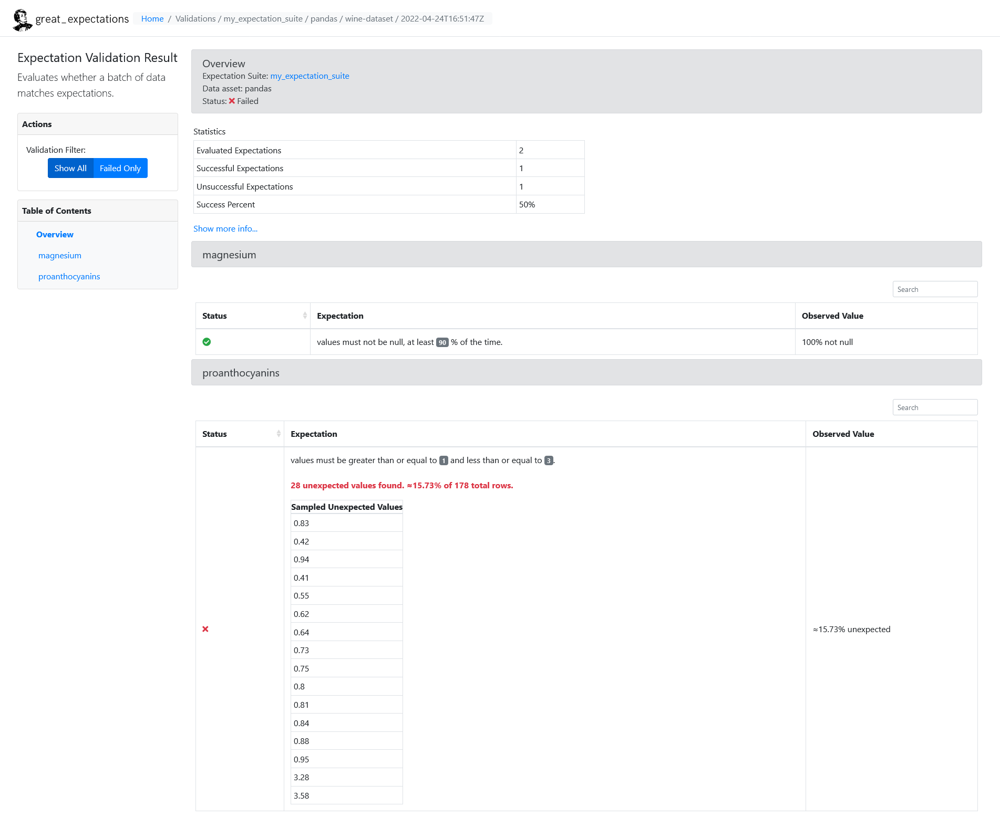

<div id="top"></div>

<br />
<h2 align="center">Using Great Expectations with Postges and MinIO as Backend</h2>
<br />
</div>


1. [About the Project](#about-the-project)
2. [Build with](#build-with)
3. [Usage](#usage)
4. [Contact](#contact)
<br />


### About the Project <a id="about-the-project"></a>
This project demonstrates how to use Postgres and MinIO as backend for Great Expectations.

<p align="right">(<a href="#top">back to top</a>)</p>


### Built with <a id="build-with"></a>
The project was built with **Python 3.9.12**, **Docker version 20.10.14**, **Postgres** and **MinIO**.
The python requirements are listed in **requirements.txt**.

The main requirements are the following:

* [python](https://www.python.org/)
* [docker](https://www.docker.com/)
* [PostgreSQL](https://www.postgresql.org/)
* [MinIO](https://min.io/)
* [great_expectations](https://greatexpectations.io/)
* [python-dotenv](https://pypi.org/project/python-dotenv/)
* [scikit-learn](https://scikit-learn.org/) _for the test dataset_

<p align="right">(<a href="#top">back to top</a>)</p>


### Usage <a id="usage"></a>
The `ExpectationsStore` is setup as a **Postgres** database. The `ValidationsStore` and the `Data Docs` are configured as a **MinIO** data storage.

1. Clone the repository
   ```sh
   git clone https://github.com/SimonReitzner/using-great-expectations-with-postges-and-minio-as-backend.git
   ```
2. Access folder
   ```sh
   cd using-great-expectations-with-postges-and-minio-as-backend
   ```
3. Create `.env` file from `template.env` 
4. Build and run docker (with docker compose)
   ```sh
   docker-compose up -d
   ```
5. Run validation
   ```sh
   python main.py
   ```



<p align="right">(<a href="#top">back to top</a>)</p>


### Contact <a id="contact"></a>
Project Link: [Using Great Expectations with Postges and MinIO as Backend](https://github.com/SimonReitzner/using-great-expectations-with-postges-and-minio-as-backend)

<p align="right">(<a href="#top">back to top</a>)</p>
